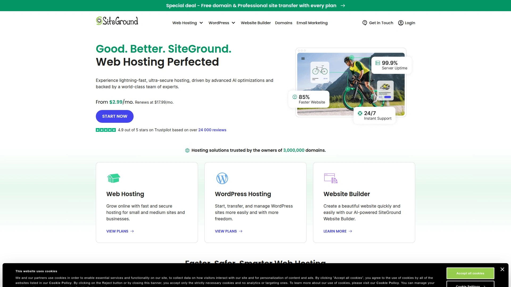
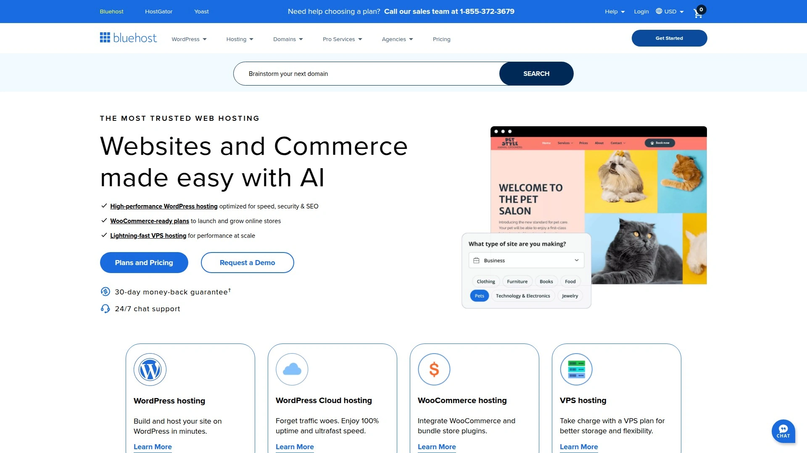
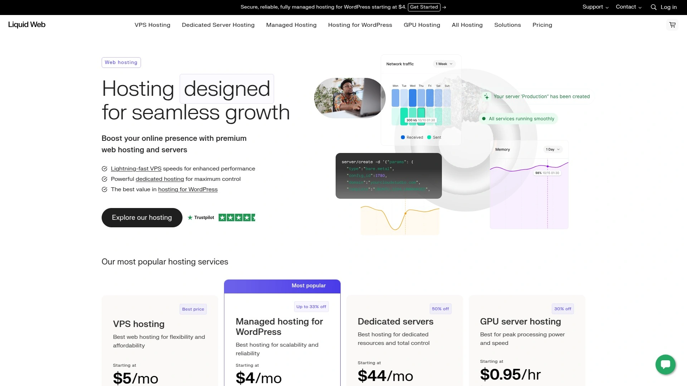
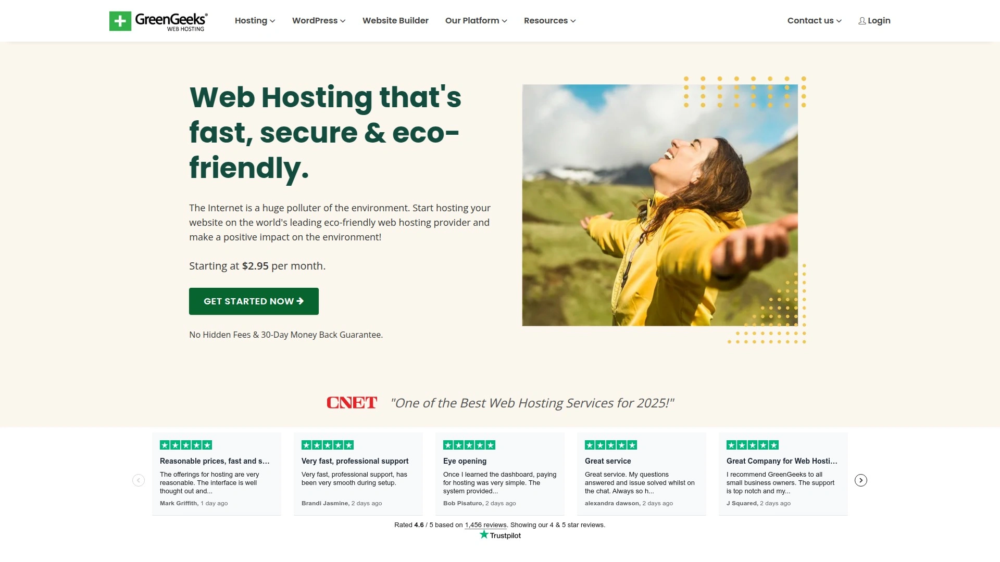
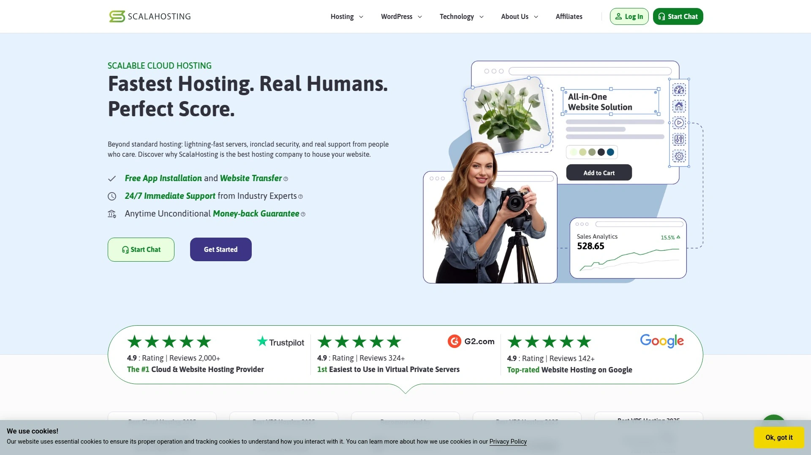

# Top 12 Web Hosting Services Ranked in 2025 (Latest Compilation)

Finding reliable, fast, and affordable web hosting can be a real headache, especially when your website’s uptime and speed decide your visitors' patience and trust. This roundup covers top web hosting services known for their stability, security, and user-friendly features tailored to businesses and creators wanting hassle-free online presence with solid performance.

## [Hostwinds](https://www.hostwinds.com)

Affordable and flexible hosting suitable for small to medium businesses looking for dependable uptime and scalable solutions.

Hostwinds offers a range of hosting options including shared, VPS, and dedicated servers with strong uptime guarantees and competitive pricing. It supports cPanel for easy management and provides 24/7 live support. The platform is well-regarded for its balance of performance and customer service, helping business sites stay online with minimal interruptions and offering plenty of room to grow.

## [Hostinger](https://www.hostinger.com)

Best for speed and budget-friendly options with an easy-to-use custom control panel.

Hostinger uses LiteSpeed web servers and SSD storage, ensuring fast load times and reliable uptime consistently. It features a custom-built hPanel for quick site management and automated WordPress installation. Plans start at a low price without compromising quality, making it ideal for small businesses and bloggers aiming for excellent value.

## [SiteGround](https://www.siteground.com)

Trusted by small businesses for powerful hosting, great support, and WordPress optimizations.

SiteGround shines in customer service with its award-winning support and offers managed WordPress plans. Their infrastructure supports fast load times across global data centers and robust security features, including daily backups and free SSL certificates. They are particularly recommended for growing sites focused on stability and ease of use.

## [Bluehost](https://www.bluehost.com)

Well-rounded choice known for beginner-friendly tools and scalable performance.

Bluehost provides easy WordPress integrations with one-click installs, free SSL, and domain registration options. Its hosting plans support multiple websites and feature Cloudflare CDN for improved speed. The 24/7 support helps users with prompt live chat and phone assistance, making it suitable for newcomers and small businesses alike.

## [Hosting.com](https://hosting.com)

High-performance hosting with optimized servers designed for busy WordPress sites and global reach.

Hosting.com offers LiteSpeed servers combined with Cloudflare CDN, providing excellent speeds and security. Their 24/7 “Guru Crew” support is praised for solving advanced performance issues. It's tailored for sites requiring robust processing power and global availability.

## [InMotion Hosting](https://www.inmotionhosting.com)

Great for US-based businesses needing reliable support and scalable hosting plans.

InMotion Hosting features UltraStack technology for speed, unlimited bandwidth, and up to 100GB storage on entry plans. Uptime is solid with 99.9% guarantees, and the US-based support team is available round-the-clock through multiple channels. It’s especially good for small businesses wanting strong domestic customer service.

## [Liquid Web](https://www.liquidweb.com)

Enterprise-grade hosting with fully managed VPS and dedicated servers for demanding sites.

Liquid Web offers a suite of high-performance hosting solutions with proactive management and strong security. Their infrastructure is designed for missions-critical websites and e-commerce stores needing maximum uptime and rapid customer support.

## [GreenGeeks](https://www.greengeeks.com)

Eco-friendly hosting that combines green energy with solid reliability and ease of use.

GreenGeeks promises carbon-neutral hosting without sacrificing performance. It offers shared, VPS, and reseller hosting plans, including automatic backups, free CDN integration, and 24/7 support. Ideal for environmentally conscious users seeking dependable uptime.

## [IONOS](https://www.ionos.com)

A broad range of hosting plans with strong uptime and a global network for fast loading times.

IONOS provides scalable hosting services featuring SSD storage, daily backups, and enterprise-level security tools. It offers personalized customer support and is a solid option for businesses scaling their web presence with global reach.

## [Nexcess](https://www.nexcess.net)

Premium hosting with a focus on e-commerce and CMS platforms like WordPress and Magento.

Nexcess offers managed hosting with built-in caching and automation to boost site speed. Their network spans multiple continents with a 100% uptime guarantee on premium plans, perfect for stores and content-driven websites.

## [HostArmada](https://www.hostarmada.com)

Reliable hosting with fast setup times and competitive prices focused on beginners and SMBs.

HostArmada provides NVMe-based SSD storage and a cPanel-driven experience with automatic backups and malware protection. Their customer support is proactive and user-friendly, making it a strong contender for start-ups.

## [ScalaHosting](https://www.scalahosting.com)

Innovative cloud VPS hosting with security-first approach and flexible management tools.

ScalaHosting boasts advanced features like SShield security, Spartacus control panel, and dedicated IP options. It’s loved by users who want VPS power without complex server management.

***

## FAQ

**Does Hostwinds support scalability for growing businesses?**
Yes, Hostwinds offers flexible shared, VPS, and dedicated hosting plans, making it easy to scale as your traffic increases.

**Can beginners manage Hostinger or Bluehost easily?**
Both platforms provide user-friendly control panels and one-click installations, ideal for beginners without technical backgrounds.

**Which hosts offer the best uptime guarantees?**
SiteGround, Nexcess, and InMotion Hosting provide strong uptime guarantees around 99.9% to 100%, backed by reliable infrastructure.

***

This list brings together the top 12 web hosting services in 2025 that balance speed, uptime, ease of use, and customer support to suit diverse needs. Among them, [Hostwinds](https://www.hostwinds.com) stands out as the go-to choice for small to mid-sized businesses because of its excellent uptime reliability, user-friendly options, and scalability, making it an ideal solution for growing web projects.
